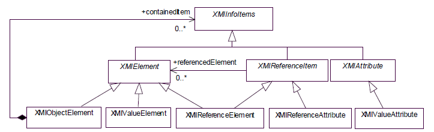
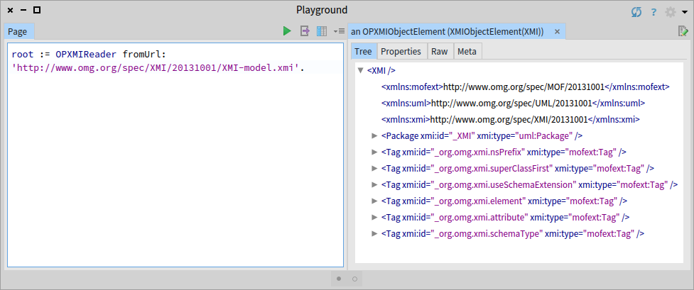
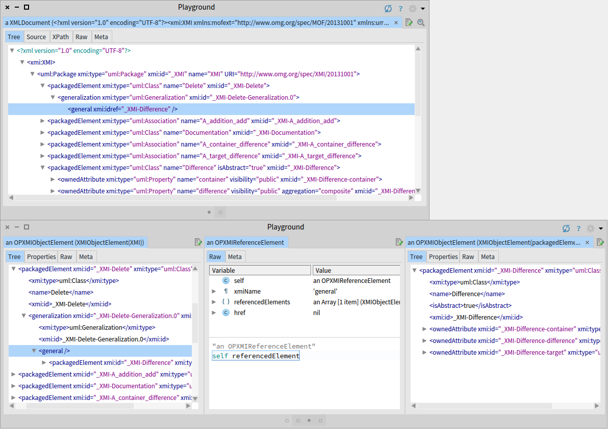

# XMI
[](https://travis-ci.com/OpenPonk/xmi) [](https://coveralls.io/github/OpenPonk/xmi?branch=master)

Mapping library between XML documents and XMI serialization models based on OMG's [XMI 2.5.1 specifications](http://www.omg.org/spec/XMI/2.5.1/).



If you are looking for a library to read XMI into a UML (and vice versa), see [OpenPonk/uml-xmi](https://github.com/OpenPonk/uml-xmi).

## Installation

```smalltalk
Metacello new
	baseline: 'OPXMI';
	repository: 'github://OpenPonk/xmi/repository';
	load.
```

## Basic Usage

### Reading

Reading a XML string/stream, or an url.

```smalltalk
root := OPXMIReader readFrom: aReadStream.
root := OPXMIReader readFromUrl: 'http://www.omg.org/spec/XMI/20131001/XMI-model.xmi'.
```

### Writing

A XMI graph can be converted back into a XML string.

```smalltalk
inXml := (ZnEasy get: 'http://www.omg.org/spec/UML/20131001/PrimitiveTypes.xmi') entity contents.
xmiGraph := OPXMIReader readFrom: inXml readStream.
outXml := OPXMIWriter writeToString: xmiGraph.
```



## Advanced Usage

### Element References

A reference element (string) in the XML is converted into a direct object reference to the target element.




### HREF Resolution

XMI supports referencing other elements in the document *(xmi:idref and attribute="idRef" are already handled automatically)* as well as in other documents; we handle this via mapping.

`AA.xmi`
```xml
<container>
	<aaItem xmi:id="AAX">
		<bee href="BB.xmi#BBX" />
	</aaItem>
</container>
```

`BB.xmi`
```xml
<container>
	<bbItem xmi:id="BBX" />
</container>
```

**NOTE:** *The key of the mapping has to be equal to the referenced URI.*

```smalltalk
"the order doesn't matter"
mapping := Dictionary
		with: 'AA.xmi' -> 'AA.xmi' asFileReference contents
		with: 'BB.xmi' -> 'BB.xmi' asFileReference contents
resultMapping := OPXMIReader readFromMapping: mapping.

aaItem := (resultMapping at: 'AA.xmi') containedItems first.
bbItem := (resultMapping at: 'BB.xmi') containedItems first.
self assert: aaItem containedItems second referencedElement equals: bbItem.
```
