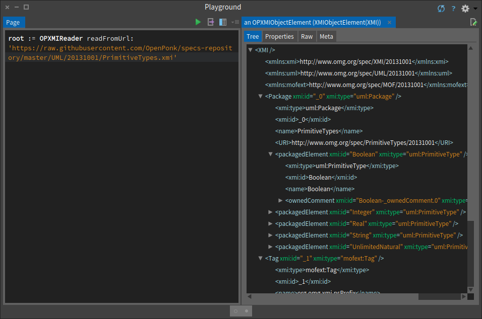

# XMI
[](https://travis-ci.org/OpenPonk/xmi) [](https://coveralls.io/github/OpenPonk/xmi?branch=master)

WIP implementation of XMI graph representation in Pharo.

[OMG XMI 2.5.1 Specs](http://www.omg.org/spec/XMI/2.5.1/)

## Installation

```smalltalk
Metacello new
	baseline: 'OPXMI';
	repository: 'github://OpenPonk/xmi/repository';
	load.
```

## Usage

### Materialization



```smalltalk
root := OPXMIReader fromUrl: 'http://www.omg.org/spec/XMI/20131001/XMI-model.xmi'.
root := OPXMIReader fromFile: '/home/user/XMI-model.xmi' asFileReference.
root := OPXMIReader from: aReadStream.
```


A reference element in the XML is converted into a direct reference to the target element.


### Serialization

A XMI graph can be converted back into a XML file with writer.

```smalltalk
xmiGraph := OPXMIReader fromUrl: 'http://www.omg.org/spec/XMI/20131001/XMI-model.xmi'.
xmlString := OPXMIWriter writeToString: root.
```

See tests and XMI specs for usage.
